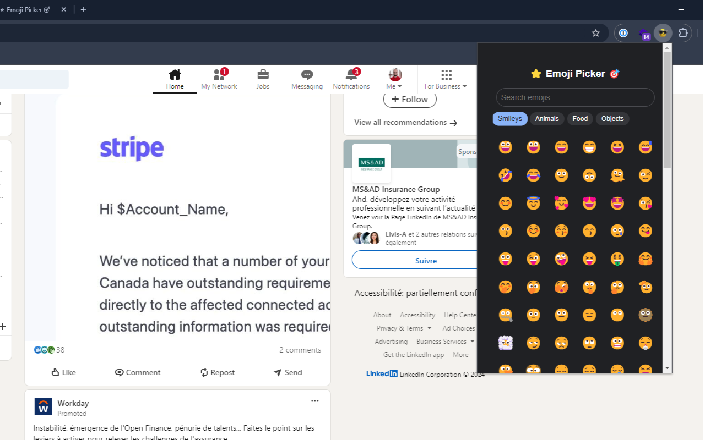

# ⭐ Emoji Picker Chrome Extension

A sleek, modern emoji picker that lives in your browser! Quickly find and copy emojis with style.



## ✨ Features

- 🎨 **Beautiful Design** - Clean interface with smooth animations
- 🌙 **Auto Dark Mode** - Automatically matches your browser's theme
- 🔍 **Smart Search** - Find emojis by name, category, or description
- 📋 **Quick Copy** - One click to copy any emoji
- 🚀 **Fast & Lightweight** - Loads instantly, uses minimal resources
- 🎯 **Category Tabs** - Organized access to all your favorite emojis
  - Smileys & Emotions
  - Animals & Nature
  - Food & Drink
  - Objects & More

## 🚀 Installation

### From Chrome Web Store
1. Visit the [Chrome Web Store](your-store-link)
2. Click "Add to Chrome"
3. Enjoy your new emoji picker!

### Manual Installation (Developer Mode)
1. Clone this repository:
   ```bash
   git clone https://github.com/yourusername/emoji-picker.git
   ```
2. Open Chrome and go to `chrome://extensions/`
3. Enable "Developer mode" in the top right
4. Click "Load unpacked" and select the extension directory
5. The extension icon will appear in your toolbar

## 🎯 Usage

1. Click the extension icon in your toolbar
2. Browse categories or search for specific emojis
3. Click any emoji to copy it to your clipboard
4. Paste anywhere you want! 🎉

## 🛠️ Development

### Prerequisites
- Google Chrome
- Basic knowledge of HTML, CSS, and JavaScript

### Setup 